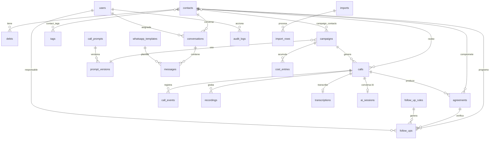

# Modelo de Base de Datos

PostgreSQL 16 (compatible con Neon). Todas las entidades expuestas usan `id bigint` interno + `uuid` público.
Soft deletes en: users, contacts, debts, campaigns, agreements, conversations, call_prompts, plantillas.

## Diagrama entidad-relación (núcleo)

## Tablas por dominio

| Dominio | Tablas | Notas |
|---|---|---|
| Seguridad | users, roles, permissions, model_has_roles, model_has_permissions, role_has_permissions, personal_access_tokens, password_reset_tokens, login_audits | spatie/laravel-permission + Sanctum |
| Contactos | contacts, tags, contact_tags, internal_notes (polimórfica) | índices: phone, dni, status, segment, city, (last_name, first_name) |
| Deuda | debts, debt_sync_logs | unique (contact_id, code); jsonb extra_data para integración LAMB |
| Campañas | campaigns, campaign_contacts | jsonb: segment_filters, dtmf_options, whatsapp_config, post_call_actions; unique (campaign_id, contact_id); índice next_attempt_at |
| Llamadas | calls, call_events, recordings, transcriptions | índices: twilio_call_sid, (campaign_id,status), (contact_id,created_at), scheduled_at; en recordings SOLO metadata (archivo en S3) |
| IA | call_prompts, prompt_versions, ai_sessions | unique (call_prompt_id, version); ai_sessions guarda turnos + tool_calls + resultado estructurado |
| Cobranza | agreements, follow_ups, follow_up_rules, assignments | índices: (status, promise_date), (status, scheduled_at) |
| WhatsApp | conversations, messages, whatsapp_templates, message_templates | índices: message_sid, (conversation_id, created_at), last_message_at; last_inbound_at controla ventana 24h |
| Operación | webhook_events (unique idempotency_key), audit_logs, system_settings (valores cifrados), integrations (credenciales cifradas AES-256), cost_entries, imports, import_rows | |
| Laravel | jobs, failed_jobs, job_batches, cache, sessions | colas en Redis en runtime |

## Convenciones

- **Estados**: definidos como constantes en cada modelo (`Debt::STATUSES`, `Campaign::STATUSES`, `Call::FINAL_STATUSES`, `Agreement::STATUSES`).
- **Idempotencia de webhooks**: `webhook_events.idempotency_key` = `tipo:SID:estado` con índice unique; el segundo evento idéntico se marca `duplicate` y no se procesa.
- **Auditoría**: trait `Auditable` registra created/updated/deleted con old/new values (excluye campos hidden); acciones especiales (launch, listen, export, merge) se registran manualmente con `AuditLog::record()`.
- **Archivos**: grabaciones, audios de campaña y adjuntos van a S3/R2/MinIO; PostgreSQL solo guarda url, path, duración, tamaño, mime, hash y metadata.
